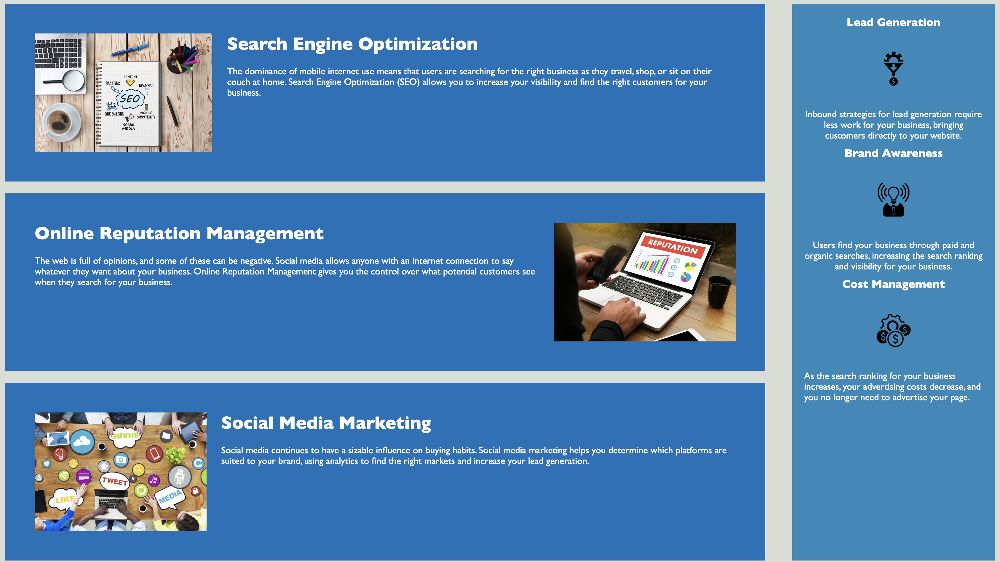
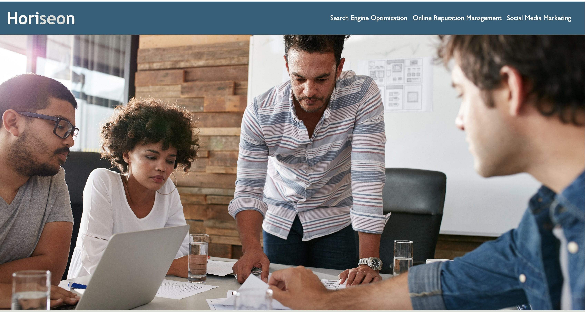

# Benefits of social media in business

## Description

For this project I wanted to create a easy to use and assessable website. Giving the user a good and enjoyable experience. The purpose of this project was to meet the accessibility standards for ever user that visits and experience the website. The website that I edited solves problems like lack of sematic elements in the html, organizing issues in the html and css, errors and malfunctioning code with the the html and css files. Giving the website an unfinished and malfunctioning functions. After I solved all the problems with the website, my task of providing a assessable and function website was an success. I learned many ways to use css and how to give a website organization and design. Also what good html code looks like and the proper way to set up a website.

### usage 
To use and explore this site open your designate browser. copy and paste this url, https://jacobk05.github.io/02challenge/ 

### Screenshots 

